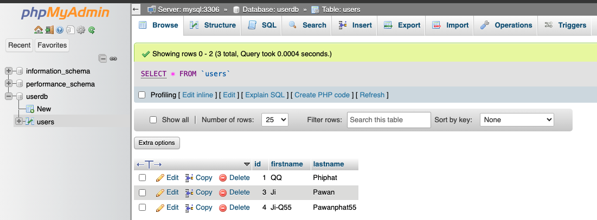
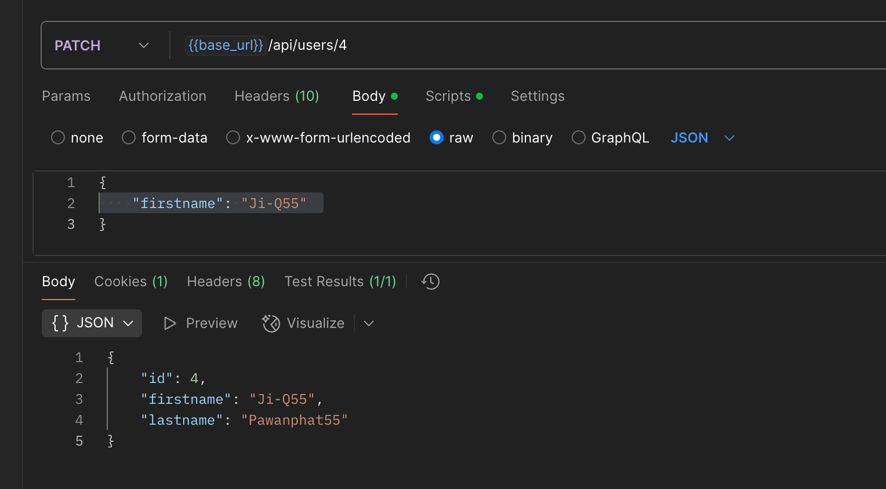

# spring_boot_rest_api

Learn from youtube channel : https://www.youtube.com/watch?v=Ka7Sm8W84iw

Now can understand all methods in Spring boot version 3.4.3 
[POST, GET, PUT, DELETE, PATCH] 

---

## Run project.
- make up
- make run-maven

## Stop project.
- make down

## Check Database (phpmyadmin)
- http://localhost:8080/
- username : admin
- password : 1234

## APIs
- POST http://localhost:8081/users
- GET http://localhost:8081/users
- GET http://localhost:8081/users/{id}
- PUT http://localhost:8081/users/{id}
- PATCH http://localhost:8081/users/{id}
- DELETE http://localhost:8081/users/{id}

---

### Photos

Path: `/Users/atthana/Desktop/Private_Q/Trainings/18_Java/spring_boot_rest_api`